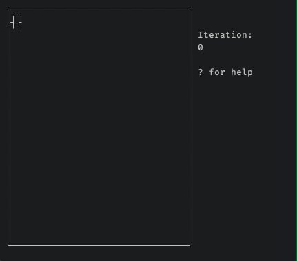

# Game of Life



This is an implementation of Conway's Game of Life for the terminal.
```
usage: gol.py [-h] [-w ROWS COLUMNS] [-p] [-s {1,2,3,4,5,6,7,8,9}] [-n] [-l FILE]

Conway's Game of Life.

optional arguments:
  -h, --help            show this help message and exit
  -w ROWS COLUMNS, --winsize ROWS COLUMNS
                        number of rows and columns in display
  -p, --play            autoplay on start
  -s {1,2,3,4,5,6,7,8,9}, --speed {1,2,3,4,5,6,7,8,9}
                        autoplay speed
  -n, --nowrap          do not wrap the game of life world
  -l FILE, --load FILE  load file
```

For example, run `gol.py --winsize 50 80` for a terminal window with 50 lines and 80 columns.
Run `gol.py -w 20 52 -l conway.gol -ps 1` to get a window with 20 lines and 52 columns, load `conway.gol`, and start playing with speed 1.
RUn `gol.py -w 32 100 -l gosper.gol -nps5` to get the Gosper glider gun playing with speed 5, without the wraparound effect 
(which would otherwise cause the gliders to destroy the gun).

This program supports editing cells (using the keyboard), autoplay at different speeds, as well as saving and loading files.
Press `?` to get a complete list of commands.
